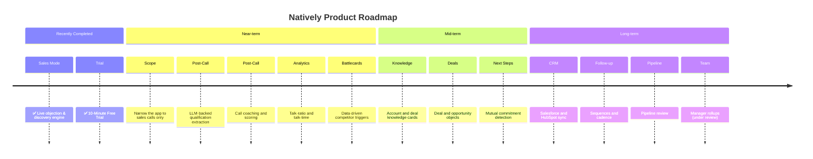

# [Sponsored by Recall AI - API for desktop recording](https://docs.recall.ai/docs/desktop-sdk?utm_source=github&utm_medium=sponsorship&utm_campaign=evinjohnn-natively-ai-assistant)

If you’re looking for a hosted desktop recording API, consider checking out [Recall.ai](https://docs.recall.ai/docs/desktop-sdk?utm_source=github&utm_medium=sponsorship&utm_campaign=evinjohnn-natively-ai-assistant), an API that records Zoom, Google Meet, Microsoft Teams, in-person meetings, and more.

<div align="center">
  

# Natively — Real-Time AI Copilot for Sales Calls

**Live objection handling, discovery prompts, and buying-signal detection while the call is still happening.**
<br/>
**Grounded in your own product decks, pricing sheets, battlecards, and case studies. Runs on your machine. Bring your own AI keys.**
<br/>

<br/>

[](LICENSE)
[](https://github.com/Natively-AI-assistant/natively-cluely-ai-assistant/releases)
[](https://github.com/Natively-AI-assistant/natively-cluely-ai-assistant/releases)

[](https://github.com/Natively-AI-assistant/natively-cluely-ai-assistant)

[](https://t.me/nativelyaichat)
[](https://www.linkedin.com/company/nativley-ai)

> **Competitors charge $20–$149/month, store your data on their servers, and one already breached 83,000 users.** Natively costs $0, runs locally, and has never had a data breach. Your keys, your models, your machine.

<p align="center">
  <a href="https://natively.software">
    
  </a>
</p>

<p align="center">
  <a href="https://github.com/Natively-AI-assistant/natively-cluely-ai-assistant/releases/latest">
    
  </a>
  <a href="https://github.com/Natively-AI-assistant/natively-cluely-ai-assistant/releases/latest">
    
  </a>
</p>

<small>Requires macOS 12+ (Apple Silicon & Intel) or Windows 10/11</small>

<br/>

**<span style="color: #ef4444">👥 9,000+ Users</span>** &nbsp;·&nbsp; **<span style="color: #f97316">🔥 700+ DAU</span>** &nbsp;·&nbsp; **<span style="color: #22c55e">💸 $0 vs $149/mo rivals</span>** &nbsp;·&nbsp; **<span style="color: #3b82f6">⚡ <500ms latency</span>** &nbsp;·&nbsp; **<span style="color: #a855f7">🛡️ 0 data breaches</span>**

</div>

---

## Why Natively?

While other tools act as simple API wrappers, Natively is a complete, native intelligence system built specifically for live sales calls.

- **Native Audio Capture (<500ms):** Built with Rust and Zero-Copy ABI transfers, bypassing generic web-audio limitations for ultra-low latency.
- **Local Whisper STT (On-Device):** 100% on-device speech-to-text using optimized ONNX models (Moonshine-tiny, Moonshine-base, Whisper-large-v3-turbo, distil-large-v3). Uses hardware acceleration (CoreML/Metal GPU on Apple Silicon, DirectML on Windows, quantized int8 on CPU) with zero cloud fees or data exposure.
- **Dual-Channel Intelligence:** Distinct pipelines for system audio (what they say) and your microphone (what you dictate) ensuring perfect transcription without room noise.
- **Invisible During Screen Share:** Your copilot window doesn't appear when you share your screen with a prospect — they see your demo, not your notes.
- **Sales Call Intelligence:** A dedicated sales mode with objection handling, discovery prompts, buying-signal detection, and a note template that captures account context, pain points, objections, budget/timeline/authority, and next steps.
- **Custom Context & Notes:** A dedicated free-form notes area for deal context and talk tracks (up to 8,000 characters), automatically injected into real-time LLM prompts.
- **Rolling Context:** We don't just transcribe; we maintain a "memory window" of the conversation for smarter answers.
- **Local RAG Memory:** We embed your meetings locally using SQLite vector search so you can ask, "What did John say about the API last week?"
- **Reference Files:** Deeply integrate PDFs, DOCX, and TXT files as real-time context.
- **Rich Dashboard:** A full UI to manage, search, and export your history—not just a floating window.
- **Fully Offline Capable:** Don't trust the cloud? Run Natively 100% offline using local Ollama models and local Whisper STT.

---

### ⭐ Star this repo — it matters

Every star pushes Natively higher in GitHub search, helping sales teams find a private, local-first alternative to tools that store their call data on someone else's server.

[](https://github.com/Natively-AI-assistant/natively-cluely-ai-assistant)

</div>

---

## Demo


This demo shows **a complete live call scenario**:

- Real-time transcription as the call happens
- Rolling context awareness across multiple speakers
- Instant generation of what to say next
- Follow-up questions and concise responses
- All happening live, without recording or post-processing

---

## Natively API (Hosted Tier)

**Stop managing four separate services. One key. Zero configuration.**

Are you managing separate accounts for your AI reasoning, live transcription, fast inference, and web search? Juggling multiple API keys, rate limits, and invoices across completely different categories of tools is unnecessary overhead. Natively API replaces all of those categories with **one flat subscription**.

Under the hood, Natively API connects you to the absolute best models for the optimal user experience:

- **Backend AI Models**: Claude, OpenAI, Gemini, and Groq.
- **Premium STT Models**: Google Chirp 2/3, ElevenLabs Scribe v2, and Deepgram Nova-3.

### 4 Categories → 1 Key

**Your current unbundled stack:**

- **AI Intelligence (GPT/Claude/Gemini):** per-token billing and usage anxiety
- **Lightning-Fast Inference (Groq/Llama):** strict rate limits to monitor
- **Real-Time Transcription (Deepgram/Google STT):** separate key + quota
- **Web Search & Research (Tavily/Perplexity):** yet another subscription

**Replaced by Natively API:**

- **AI chat, transcription & web search** — all included
- **One flat subscription.** Zero surprise bills. Starts at $8/mo.
- **Single key.** Zero rotation. Zero configuration.

### API Plan Comparison

| Feature                               | Standard ($8/mo) | Pro ($15/mo) | Max ($25/mo) | Ultra ($35/mo) |
| :------------------------------------ | :--------------- | :----------- | :----------- | :------------- |
| **All-in-One Cloud AI Access**        | ✅ Yes           | ✅ Yes       | ✅ Yes       | ✅ Yes         |
| **Real-Time Transcription**           | ✅ Yes           | ✅ Yes       | ✅ Yes       | ✅ Yes         |
| **Included Natively Pro Desktop App** | ❌ No            | ✅ Yes       | ✅ Yes       | ✅ Yes         |
| **Premium Support**                   | ❌ No            | ✅ Yes       | ✅ Yes       | ✅ Yes         |
| **Higher Monthly Quotas**             | ❌ No            | ✅ Yes       | ✅ Yes       | ✅ Yes         |

**Don't start the long way.** Skip the 20-minute manual setup. One Natively subscription skips all of it — AI, transcription, and web search are ready immediately.

<p align="center">
  <a href="https://checkout.dodopayments.com/buy/pdt_0NbFixGmD8CSeawb5qvVl">
    
  </a>
  <a href="https://checkout.dodopayments.com/buy/pdt_0NcM6Aw0IWdspbsgUeCLA">
    
  </a>
  <a href="https://checkout.dodopayments.com/buy/pdt_0NcM7JElX4Af6LNVFS1Yf">
    
  </a>
  <a href="https://checkout.dodopayments.com/buy/pdt_0NcM7rC2kAb69TFKsZnUU">
    
  </a>
</p>

---

## Natively Pro

While Natively is **free for personal, educational, research, and non-commercial use**, we also offer a **Pro Edition** (available as **Lifetime or Yearly** subscriptions) designed for sales teams and power users. Purchasing a Pro license directly supports the continued development of Natively.

### 🪙 Unlock Natively Pro with $NAT Token

We've launched the official **$NAT token** on Printr! Holders who maintain a specific balance of `$NAT` tokens in their connected wallet automatically unlock access to all **Natively Pro** features.

👉 **[Trade $NAT on Printr](https://app.printr.money/trade/0xba1e50273ec14ca52b3fa64a5054c39470c2835392c6ecd06876f5bccd597d7b)**

### Free vs Pro Feature Comparison

| Feature                                             | Natively Free | Natively Pro |
| :-------------------------------------------------- | :-----------: | :----------: |
| **Bring Your Own Key (BYOK) Models**                |      ✅       |      ✅      |
| **Local AI Support (Ollama)**                       |      ✅       |      ✅      |
| **Local Whisper STT (On-Device)**                   |      ✅       |      ✅      |
| **Real-Time Speech-to-Text (<500ms)**               |      ✅       |      ✅      |
| **Multi-Key API Pools & Key Rotation**              |      ✅       |      ✅      |
| **Profile Intelligence Router (v2)**                |      ✅       |      ✅      |
| **Eager Code UI Expansion**                         |      ✅       |      ✅      |
| **Live Follow-Up Resolver**                         |      ✅       |      ✅      |
| **Real-Time Latency Tracing**                       |      ✅       |      ✅      |
| **Two New Meeting UI Styles (Liquid Glass/Modern)** |      ✅       |      ✅      |
| **Live Contextual Assistant**                       |      ✅       |      ✅      |
| **Screenshot & Slide OCR Analysis**                 |      ✅       |      ✅      |
| **Undetectable & Stealth Modes**                    |      ✅       |      ✅      |
| **Meeting Dashboard & Offline RAG History**         |      ✅       |      ✅      |
| **Stateful "Intelligence OS"**                     |      ✅       |      ✅      |
| **Spoken Answer Humanizer**                         |      ✅       |      ✅      |
| **Sandboxed Code Verification**                     |      ✅       |      ✅      |
| **Hindsight Long-Term Memory (LTM)**                |      ❌       |      ✅      |
| **Automated Company Research & Dossiers**           |      ❌       |      ✅      |
| **Live Salary & Offer Negotiation Copilot**         |      ❌       |      ✅      |
| **Custom Persona Modes (Sales, Tech, etc.)**        |      ❌       |      ✅      |
| **Custom Context & Notes**                          |      ❌       |      ✅      |
| **Reference Files (PDF/DOCX/TXT upload)**           |      ❌       |      ✅      |
| **Phone Link Companion App**                        |      ❌       |      ✅      |
| **Auto-Calendar & Task Sync**                       |      ❌       |      ✅      |
| **Speaker Diarization**                             |      ❌       |      ✅      |
| **Priority Feature Access & Support**               |      ❌       |      ✅      |

<p align="center">
  <a href="https://checkout.dodopayments.com/buy/pdt_0NbHo6EnXlNPqNcZ14OTi">
    
  </a>
  <a href="https://checkout.dodopayments.com/buy/pdt_0NcM4QBwy0CDcPV9CXaNP">
    
  </a>
</p>

### What's New in v2.8.0 (Latest Release)

Version 2.8.0 introduces the stateful "Intelligence OS" control plane, Hindsight long-term memory, deterministic answer humanization, sandboxed local code execution, and low-latency regional STT relay migration:

- **Stateful "Intelligence OS"**: Transitioned to a stateful control plane with mode-aware priors that automatically route queries and filter context based on your active task.
- **Hindsight Long-Term Memory (LTM)**: Integrates a secure local sidecar vector database that indexes past meetings, custom profiles, and documents, retrieving relevant semantic matches dynamically.
- **Spoken Answer Humanizer**: Deterministically rewrites raw LLM outputs to strip corporate jargon, filter out structure bugs (em-dashes, empty bullets), and optimize prose for natural spoken flow.
- **Sandboxed Code Verification**: Automatically extracts and executes Python, JS, and SQLite code in isolated local subprocesses, verifying correctness and auto-correcting errors before displaying a verified badge.
- **Regional STT-Relay Migration**: Migrated realtime audio transcription to low-latency regional VPS hosts with transaction-scoped quota advisory locks to prevent double-billing.
- **macOS 12 (Monterey) Compatibility Guard**: Added safety checks to prevent runtime crashes during Whisper local speech-to-text initialization on older macOS versions.

## Table of Contents

- [Why Natively?](#why-natively)
- [Demo](#demo)
- [Natively API (Hosted Tier)](#natively-api-hosted-tier)
- [Natively Pro](#natively-pro)
- [What's New in v2.8.0](#whats-new-in-v280-latest-release)
- [Privacy & Security](#privacy--security-core-design-principle)
- [Installation](#installation-developers--contributors)
- [AI Providers](#ai-providers)
- [Key Features](#key-features)
- [Meeting Intelligence Dashboard](#meeting-intelligence-dashboard)
- [Roadmap](#roadmap)
- [Use Cases](#use-cases)
- [Technical Details](#technical-details)
- [Known Limitations](#known-limitations)
- [Responsible Use](#responsible-use)
- [Contributing](#contributing)
- [License](#license)
- [FAQ](#faq)
- [Star History](#star-history)

---

## What Is Natively?

**Natively** is a **desktop AI copilot for live sales calls**:

- Discovery calls
- Demos
- Pricing and objection conversations
- Renewals and expansion calls
- Client check-ins

It provides:

- Live answers
- Rolling conversational context
- Screenshot and document understanding
- Real-time speech-to-text
- Instant suggestions for what to say next

All while remaining **invisible, fast, and privacy-first**.

---

## Privacy & Security (Core Design Principle)

- Source-available under the Natively Personal Use Source License v1.0
- Bring Your Own Keys (BYOK)
- Local AI option (Ollama)
- All data stored locally
- Limited anonymous telemetry (basic GA4 counts)
- No user data tracking
- No hidden uploads

You explicitly control:

- What runs locally
- What uses cloud AI
- Which providers are enabled

---

## Installation (Developers & Contributors)

> [!NOTE]
> **macOS Users (Both Apple Silicon & Intel Macs supported):**
>
> 1.  **"Unidentified Developer"**: If you see this, Right-click the app > Select **Open** > Click **Open**.
> 2.  **"App is Damaged"**: If you see this, run the command in Terminal based on your download:
>
>     **For .zip downloads:**
>
>     ```bash
>     xattr -cr /Applications/Natively.app
>     ```
>
>     **For .dmg downloads:**
>     1. Open Terminal and run:
>        ```bash
>        xattr -cr ~/Downloads/Natively-2.0.2-arm64.dmg # Or your specific filename
>        ```
>     2. Install the natively.dmg
>     3. Open Terminal and run: `xattr -cr /Applications/Natively.app`

### Prerequisites

- Node.js (v20+ recommended)
- Git
- Rust (required for native audio capture)

### AI Credentials & Speech Providers

**Natively is 100% free to use with your own keys.**  
Connect **any** speech provider and **any** LLM. No subscriptions, no markups, no hidden fees. All keys are stored locally.

### Unlimited Free Transcription (Whisper, Google, Deepgram)

- **Soniox** (API Key) - _Ultra-fast, highly accurate streaming STT_
- **Google Cloud Speech-to-Text** (Service Account)
- **Groq** (API Key)
- **OpenAI Whisper** (API Key)
- **Deepgram** (API Key)
- **ElevenLabs** (API Key)
- **Azure Speech Services** (API Key + Region)
- **IBM Watson** (API Key + Region)

### AI Engine Support (Bring Your Own Key)

Connect Natively to **any** leading model or local inference engine.

| Provider                     | Best For                                                    |
| :--------------------------- | :---------------------------------------------------------- |
| **Gemini 3.1 Series**        | Recommended: Massive context window (2M tokens) & low cost. |
| **OpenAI (GPT-5.4 & o3)**    | High reasoning capabilities.                                |
| **Anthropic (Claude 4.6)**   | Coding & complex nuanced tasks.                             |
| **Groq (Llama 3.3/Scout 4)** | Insane speed (near-instant answers) & screenshot analysis.  |
| **Ollama / LocalAI**         | 100% Offline & Private (No API keys needed).                |
| **OpenAI-Compatible**        | Connect to _any_ custom endpoint (vLLM, LM Studio, etc.)    |

> **Note:** You only need ONE speech provider to get started. We recommend **Google STT** ,**Groq** or **Deepgram** for the fastest real-time performance.

---

#### To Use Google Speech-to-Text (Optional)

Your credentials:

- Never leave your machine
- Are not logged, proxied, or stored remotely
- Are used only locally by the app

What You Need:

- Google Cloud account
- Billing enabled
- Speech-to-Text API enabled
- Service Account JSON key

Setup Summary:

1. Create or select a Google Cloud project
2. Enable Speech-to-Text API
3. Create a Service Account
4. Assign role: `roles/speech.client`
5. Generate and download a JSON key
6. Point Natively to the JSON file in settings

---

## Development Setup

### Clone the Repository

```bash
git clone https://github.com/Natively-AI-assistant/natively-cluely-ai-assistant.git
cd natively-cluely-ai-assistant
```

### Install Dependencies

```bash
npm install
```

### Build Native Audio Module (Rust)

```bash
npm run build:native
```

### Environment Variables

Create a `.env` file:

```env
# Cloud AI
GEMINI_API_KEY=your_key
GROQ_API_KEY=your_key
OPENAI_API_KEY=your_key
CLAUDE_API_KEY=your_key
GOOGLE_APPLICATION_CREDENTIALS=/absolute/path/to/service-account.json

# Speech Providers (Optional - only one needed)
DEEPGRAM_API_KEY=your_key
ELEVENLABS_API_KEY=your_key
AZURE_SPEECH_KEY=your_key
AZURE_SPEECH_REGION=eastus
IBM_WATSON_API_KEY=your_key
IBM_WATSON_REGION=us-south

# Local AI (Ollama)
USE_OLLAMA=true
OLLAMA_MODEL=llama3.2
OLLAMA_URL=http://localhost:11434

# Default Model Configuration
DEFAULT_MODEL=gemini-3.1-flash-lite-preview
```

### Run (Development)

```bash
npm start
```

### Build (Production)

```bash
npm run dist
```

This runs: Vite build → TypeScript compile → native module build → electron-builder

---

### AI Providers

- **Custom (BYO Endpoint):** Paste any cURL command to use OpenRouter, DeepSeek, or private endpoints.
- **Ollama (Local):** Zero-setup detection of local models (Llama 3, Mistral, Gemma).
- **Dynamic Model Selection:** Preferred models (OpenAI, Anthropic, Google) now automatically appear across the app.
- **Google Gemini:** First-class support for the Gemini 3.1 series.
- **OpenAI:** GPT-5.4 and o3 series support with optimized system prompts.
- **Anthropic:** Claude 4.6 series support with corrected max_tokens.
- **Groq:** Ultra-fast text inference with Llama 3.3, and screenshot analysis using Llama 4 Scout.

---

## Key Features

### Invisible Desktop Assistant

- Always-on-top translucent overlay
- Instantly hide/show with shortcuts
- Works across all applications

### Real-time Sales Copilot

- Real-time speech-to-text (**<500ms latency**)
- **Fast Response Mode**: Ultra-fast text responses using Groq Llama 3.3.
- **Multilingual Support**: Choose from various response languages, and set speech recognition matching specific accents and dialects.
- **Anti-Chatbot Persona System**: Refined system prompts and negative constraints keep responses concise and conversational — something you can actually say out loud on a call, with no robotic preambles.
- Context-aware Memory (RAG) across past calls
- Instant answers as questions are asked
- **Interim/Final Bridging**: Manual transcript finalization and interim bridging during recordings for higher accuracy.
- **Smart Recap & Summaries**: Instant call minutes and executive summaries.
- **TinyPrompts™ Engine**: Specialized prompt architecture for local SLMs (4B-8B params), ensuring instruction following and reasoning parity with cloud models on local hardware.
- **Dynamic Note Templates**: Structured call notes generated automatically against the sales schema — account context, pain, objections, budget/timeline/authority, next steps.
- **Pricing Guardrails**: The assistant will not volunteer your walk-away price, discount floor, or negotiating position, even when asked directly mid-call.

### Company & Prospect Research

- Pull a dossier on the account you're about to talk to
- Ground answers in your own product decks, pricing sheets, case studies, and battlecards rather than model guesswork
- **Reference Files & Custom Context**: Upload PDFs, DOCX files, or type custom instructions to give the AI real-time context on the deal.

### Skills — Custom AI Personas

Create local `SKILL.md` files to give the AI specialized instructions for any task. Skills are invoked directly from the overlay chat:

- Type `/` or `$` to open a live skill picker — filtered autocomplete with arrow-key navigation, just like Claude Code's slash commands
- Or type `/skill-name` directly to activate a skill inline
- Built-in: **Humanize AI Text** — strips AI writing patterns and makes output sound human
- Add your own: drop a `SKILL.md` with a YAML frontmatter `name:` and `description:` into `~/Library/Application Support/natively/skills/<folder>/`

### Contextual Actions

- What should I answer?
- Shorten response
- Recap conversation
- Suggest follow-up questions
- Manual or voice-triggered prompts

### Seamless Integrations & Sync

- **Phone Link:** Use your iOS/Android device as a wireless remote microphone or companion screen.
- **Calendar Prep:** Auto-syncs with Google Calendar and Outlook to prepare context before meetings.
- **Smart Task Export:** Send extracted action items directly to Jira, Linear, or Asana.
- **Speaker Diarization:** Real-time speaker identification tags individual speakers by name automatically.
- **Codex CLI:** Execute terminal tasks, manage workspace files, and run sandboxed code via native Codex integration.

### Dual-Channel Audio Intelligence

Natively understands that _listening_ to a meeting and _talking_ to an AI are different tasks. We treat them separately:

- **System Audio (The Meeting):** Captures high-fidelity audio directly from your OS (fully supported on both macOS and Windows). It "hears" what your colleagues are saying without interference from your room noise.
- **Sample Rate Auto-Detection**: Dynamically detects and syncs true hardware sample rates (e.g., automatically handling 48kHz audio interfaces or external microphones without distortion or downsampling artifacts).
- **Two-Stage Silence Processing**: Combines adaptive RMS thresholds with **WebRTC Machine Learning VAD** to reject typing and fan noise.
- **Microphone Input (Your Voice):** A dedicated channel for your voice commands and dictation. Toggle it instantly to ask Natively a private question without muting your meeting software.

### Spotlight Search & Customization

- Global activation shortcut (`Cmd+K` / `Ctrl+K`)
- **Custom Key Bindings**: Customize global shortcuts for easier control.
- Instant answer overlay
- Upcoming meeting readiness

### Local RAG & Long-Term Memory

- **Full Offline RAG:** All vector embeddings and retrieval happen locally (SQLite + `sqlite-vec`).
- **Semantic Search:** innovative "Smart Scope" detects if you are asking about the current meeting or a past one.
- **Sliding-Window RAG**: 50-token semantic overlap to prevent context loss across chunk boundaries.
- **Epoch Summarization**: Smarter transcript memory management instead of hard truncation — no more losing early meeting context.
- **Global Knowledge:** Ask questions across _all_ your past meetings ("What did we decide about the API last month?").
- **Automatic Indexing:** Meetings are automatically chunked, embedded, and indexed in the background.

### Advanced Privacy & Stealth

- **Undetectable Mode:** Instantly hide from dock/taskbar with visually locked selector to prevent state mismatches.
- **Cross-Window State Sync**: Real-time state synchronization across Settings, Launcher, and Overlay windows.
- **Process Disguise (Masquerading):** Instantly change the app to look like Terminal, System Settings, Activity Monitor, or other harmless utilities to completely evade detection during screen sharing.
- **Security Hardening**: API keys are scrubbed from memory on app quit and credentials manager overwrites key data before disposal.
- **API Rate Limiting**: Token-bucket algorithm (burst/refill) to prevent 429 errors on free-tier providers.
- **Local-Only Processing:** All data stays on your machine.

---

## Meeting Intelligence Dashboard

Natively includes a powerful, local-first meeting management system to review, search, and manage your entire conversation history.


- **Meeting Archives:** Access full transcripts of every past meeting, searchable by keywords or dates.
- **Smart Export:** One-click export of transcripts and AI summaries to **Markdown, JSON, or Text**—perfect for pasting into Notion, Obsidian, or Slack.
- **Usage Statistics:** Track your token usage and API costs in real-time. Know exactly how much you are spending on Gemini, OpenAI, or Claude.
- **Audio Separation:** Distinct controls for **System Audio** (what they say) vs. **Microphone** (what you dictate).
- **Session Management:** Rename, organize, or delete past sessions to keep your workspace clean.

---

## Roadmap



<div align="center">
  <em>For detailed feature descriptions, see our full <a href="ROADMAP.md">ROADMAP.md</a>.</em>
</div>

---

## Use Cases

### On the Call

- **Objection Handling:** When a prospect raises price, timing, security, or a competitor, get a validate-reframe-advance response grounded in your own battlecards.
- **Discovery:** Diagnostic questions surfaced at the moment the conversation opens up, so you ask the better question instead of the next one on your list.
- **Buying Signals:** Intent, urgency, and evaluation language flagged as it happens.
- **Spec Recall:** Instant answers on technical specs, integrations, or security posture, pulled from your product docs rather than invented.

### After the Call

- **Structured Notes:** Account context, pain points, buying signals, objections, budget/timeline/authority, and next steps extracted automatically.
- **Follow-Up Drafts:** A follow-up email that mirrors back the prospect's stated pain and confirms the agreed next step — never inventing pricing or commitments.
- **Cross-Call Memory:** Ask what a stakeholder said about a requirement three calls ago and get the answer with its source.

---

## Architecture Overview

Natively processes audio, screen context, and user input locally, maintains a rolling context window, and sends only the required prompt data to the selected AI provider (local or cloud).

No raw audio, screenshots, or transcripts are stored or transmitted unless explicitly enabled by the user.

---

## Technical Details

### Tech Stack

- **React, Vite, TypeScript, TailwindCSS**
- **Electron**
- **Rust** (native audio with **Zero-Copy ABI Transfers** via `napi::Buffer` — enabling continuous audio capture without V8 garbage collection pressure, achieving significantly lower latency and CPU usage than typical Electron-based competitors)
- **SQLite** (local storage with `sqlite-vec`)

### Supported Models

- **Gemini 3.1 Series**
- **OpenAI** (GPT-5.4, o3 series)
- **Claude** (4.6 series)
- **Ollama** (Llama, Mistral, CodeLlama)
- **Groq** (Llama 3.3 for text, Llama 4 Scout for OCR)

### System Requirements

- **Minimum:** 4GB RAM
- **Recommended:** 8GB+ RAM
- **Optimal:** 16GB+ RAM for local AI

---

## Responsible Use

Natively listens to live conversations. That carries obligations.

**Recording and consent are your responsibility.** Many jurisdictions — including a number of US states and most of the EU — require that *all* parties consent before a call is recorded. Others require only one. You are responsible for knowing which rules apply to you and to the person on the other end of the call, and for obtaining consent where it is required. Natively does not obtain consent on your behalf and cannot determine your jurisdiction.

**Be honest with the people you sell to.** The assistant is designed to help you recall your own product's facts and ask better questions, not to misrepresent what your product does, fabricate references, or impersonate expertise you don't have. The prompt engine deliberately refuses to invent pricing or commitments for exactly this reason.

**Respect your employer's policies.** Call recording, AI assistance, and where transcripts are stored are frequently governed by internal policy and by your customers' contracts. Check before you deploy this on customer calls.

Users are responsible for complying with workplace policies, customer contractual terms, and local laws and regulations. This project does not encourage misuse or deception.

---

## Known Limitations

- Linux support is limited and actively looking for maintainers
- Initial setup requires bringing your own API keys or installing Ollama

---

## Contributing

Contributions are welcome! Please see our [CONTRIBUTING.md](CONTRIBUTING.md) for full guidelines on how to get started.

- Bug fixes
- Feature improvements
- Documentation
- UI/UX enhancements
- New AI integrations

Quality pull requests will be reviewed and merged.

### Maintainers

| Maintainer                                 | Role          | Support                                                                                                                                                                     |
| ------------------------------------------ | ------------- | --------------------------------------------------------------------------------------------------------------------------------------------------------------------------- |
| [@evinjohnn](https://github.com/evinjohnn) | macOS Build   | [](https://www.buymeacoffee.com/evinjohnn) |
| [@razllivan](https://github.com/razllivan) | Windows Build | [](https://app.lava.top/razllivan)         |

---

## License

Licensed under the [Natively Personal Use Source License v1.0](LICENSE).

### License Notice

Natively is source-available, not open-source.

You are allowed to view, fork, modify, and run this code for personal, educational, research, and non-commercial use.

You are not allowed to use this codebase, forks, modified versions, or substantially similar derivative works for SaaS, resale, paid tools, subscriptions, client work, commercial products, startup products, agency work, or any other profit-oriented use without written permission from Natively AI Private Limited.

Public forks must clearly state that they are based on Natively, originally developed by Natively AI Private Limited.

Commercial license requests: natively.contact@gmail.com · https://natively.software

> **Note:** This project is available for sponsorships, ads, or partnerships – perfect for companies in the AI, productivity, or developer tools space.

---

**Star this repo if Natively helps you close more deals!**

---

## FAQ

#### Is Natively really free?

Yes for personal, educational, research, and non-commercial use. Natively is source-available under a personal-use source license. You only pay for what you use by bringing your own API keys (Gemini, OpenAI, Anthropic, etc.), or use it **100% free** by connecting to a local Ollama instance. Commercial use requires a separate written license.

#### Does Natively work with Zoom, Teams, and Google Meet?

Yes. Natively uses a Rust-based system audio capture that works universally across any desktop application, including Zoom, Microsoft Teams, Google Meet, Slack, and Discord.

#### Is my data safe?

Natively is built on **Privacy-by-Design**. By default, all transcripts, vector embeddings (Local RAG), and keys are stored locally on your machine. We collect only limited anonymous telemetry (no personal user data).

#### How do I use local models?

Simply install **Ollama**, run a model (e.g., `ollama run llama3`), and Natively will automatically detect it. Enable "Ollama" in the AI Providers settings to switch to offline mode.

#### How does Natively compare to Cluely?

Cluely is a $20/month cloud-based tool that stores all data on their servers. In mid-2025, Cluely suffered a data breach that exposed personal information, transcripts, and screenshots of 83,000 users. Natively is free for personal/non-commercial use, source-available, and stores everything locally. It supports any LLM (not just one vendor), offers local AI via Ollama, and has battle-tested stealth mode. Natively has never had a data breach because there is no server to breach.

#### Is stealth mode actually undetectable?

Yes. Natively hides from the dock, disguises process names as harmless system utilities (Terminal, Activity Monitor, System Settings), and syncs state across all windows. It has been hardened across five major releases and tested against screen share detection in Zoom, Teams, and Google Meet. This is best-effort, not guaranteed — on macOS 15.4+ Apple can let modern capture tools see it anyway, and a phone camera always can.

#### Zoom shows my overlay in screen share — how do I fix it?

Google Meet, Teams, and QuickTime hide Natively automatically — nothing to configure. Zoom is the one exception: whether it respects Natively's "don't capture me" flag depends on one setting.

Go to **Zoom → Settings → Share Screen → Advanced → Screen capture mode** and choose **"Advanced capture with window filtering."**

<p align="center">
  
</p>

The "...with window filtering" modes tell Zoom to leave out windows that mark themselves as private, which is exactly what Natively does. **"Advanced capture without window filtering"** grabs the raw screen and will show Natively, so avoid it.


## Star History

<a href="https://star-history.com/#evinjohnn/natively-cluely-ai-assistant&Date">
 <picture>
   <source media="(prefers-color-scheme: dark)" srcset="https://api.star-history.com/svg?repos=evinjohnn/natively-cluely-ai-assistant&type=Date&theme=dark" />
   <source media="(prefers-color-scheme: light)" srcset="https://api.star-history.com/svg?repos=evinjohnn/natively-cluely-ai-assistant&type=Date" />
   
 </picture>
</a>
