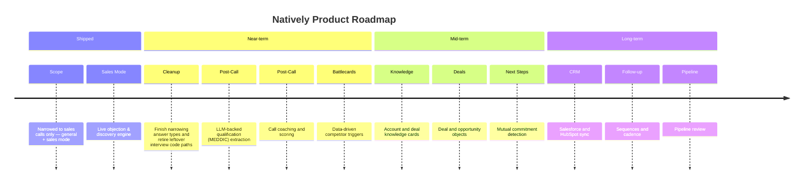

# [Sponsored by Recall AI - API for desktop recording](https://docs.recall.ai/docs/desktop-sdk?utm_source=github&utm_medium=sponsorship&utm_campaign=evinjohnn-natively-ai-assistant)

If you’re looking for a hosted desktop recording API, consider checking out [Recall.ai](https://docs.recall.ai/docs/desktop-sdk?utm_source=github&utm_medium=sponsorship&utm_campaign=evinjohnn-natively-ai-assistant), an API that records Zoom, Google Meet, Microsoft Teams, in-person meetings, and more.

<div align="center">
  

# Natively — Real-Time AI Copilot for Sales Calls

**Live objection handling, discovery prompts, and buying-signal detection while the call is still happening.**
<br/>
**Grounded in your own product decks, pricing sheets, battlecards, and case studies. Runs on your machine. Bring your own AI keys.**
<br/>

<br/>

[](LICENSE)
[](https://github.com/Natively-AI-assistant/natively-cluely-ai-assistant/releases)
[](https://github.com/Natively-AI-assistant/natively-cluely-ai-assistant/releases)
[](https://github.com/Natively-AI-assistant/natively-cluely-ai-assistant)

[](https://t.me/nativelyaichat)
[](https://www.linkedin.com/company/nativley-ai)

<p align="center">
  <a href="https://natively.software">
    
  </a>
</p>

<p align="center">
  <a href="https://github.com/Natively-AI-assistant/natively-cluely-ai-assistant/releases/latest">
    
  </a>
  <a href="https://github.com/Natively-AI-assistant/natively-cluely-ai-assistant/releases/latest">
    
  </a>
</p>

<small>Requires macOS 12+ (Apple Silicon & Intel) or Windows 10/11</small>

</div>

---

## What Is Natively?

**Natively** is a desktop app that sits on top of your sales calls (Zoom, Meet, Teams, or in person) and listens along with you. While the conversation is happening, it:

- Suggests what to say next when a prospect raises an objection (price, timing, security, a competitor)
- Surfaces the right discovery question at the moment the conversation opens up
- Flags buying signals — intent, urgency, evaluation language — as they're said
- Answers spec and pricing questions by reading your own product decks, pricing sheets, battlecards, and case studies, instead of guessing

After the call, it turns the transcript into structured notes (account context, pain points, objections, budget/timeline/authority, next steps) and drafts a follow-up email grounded in what was actually said.

It runs on your machine, keeps your data local, and works with whichever AI provider you already have a key for.

---

## Why Natively?

- **Native Audio Capture:** Built with a Rust audio module using zero-copy data transfer (no extra copying between the audio driver and the app), so transcription keeps up with a live conversation instead of lagging behind it.
- **Local Whisper Speech-to-Text (on-device):** Runs speech-to-text models directly on your computer (no audio sent to a cloud service) with hardware acceleration on Apple Silicon and Windows GPUs, or a quantized CPU fallback.
- **Dual-Channel Intelligence:** Separate audio pipelines for what the prospect says (system audio) and what you say into your microphone, so the transcript stays accurate even with room noise.
- **Invisible During Screen Share:** The copilot window doesn't appear when you share your screen with a prospect — they see your demo, not your notes.
- **Sales Call Intelligence:** A dedicated sales mode with objection handling, discovery prompts, buying-signal detection, and a structured note template.
- **Custom Context & Notes:** A free-form notes area (up to 8,000 characters) for deal context and talk tracks, automatically included in the AI's context for every answer.
- **Rolling Context:** The app keeps a running memory of the conversation so answers stay relevant as the call goes on, not just the last thing said.
- **Local RAG Memory:** Your past meetings are indexed locally (an on-device search index, not a cloud database) so you can ask "what did John say about the API last week?"
- **Reference Files:** Upload PDFs, Word docs, or text files — product specs, pricing sheets, battlecards — and the AI answers from them in real time.
- **Rich Dashboard:** A full window to search, review, and export your call history, not just a floating overlay.
- **Fully Offline Capable:** Run Natively entirely offline using local Ollama models and local Whisper speech-to-text if you'd rather not send anything to the cloud.

---

## Natively API (Hosted Tier)

**One key instead of four separate accounts.**

If you'd rather not manage separate accounts and keys for AI reasoning, live transcription, fast inference, and web search, Natively API bundles them into a single flat subscription:

- **AI models:** Claude, OpenAI, Gemini, and Groq
- **Speech-to-text:** Google Chirp, ElevenLabs Scribe, and Deepgram Nova

| Plan | Price | Includes |
| :--- | :--- | :--- |
| Standard | $8/mo | AI + transcription access |
| Pro | $15/mo | + the Natively Pro desktop app, priority support |
| Max | $25/mo | + higher monthly quotas |
| Ultra | $35/mo | + highest monthly quotas |

<p align="center">
  <a href="https://checkout.dodopayments.com/buy/pdt_0NbFixGmD8CSeawb5qvVl">
    
  </a>
  <a href="https://checkout.dodopayments.com/buy/pdt_0NcM6Aw0IWdspbsgUeCLA">
    
  </a>
  <a href="https://checkout.dodopayments.com/buy/pdt_0NcM7JElX4Af6LNVFS1Yf">
    
  </a>
  <a href="https://checkout.dodopayments.com/buy/pdt_0NcM7rC2kAb69TFKsZnUU">
    
  </a>
</p>

---

## Natively Pro

Natively is **free for personal, educational, research, and non-commercial use**. **Natively Pro** is a paid license (Lifetime or Yearly) for sales teams and power users who want a commercial license and priority support; buying one directly funds continued development.

<p align="center">
  <a href="https://checkout.dodopayments.com/buy/pdt_0NbHo6EnXlNPqNcZ14OTi">
    
  </a>
  <a href="https://checkout.dodopayments.com/buy/pdt_0NcM4QBwy0CDcPV9CXaNP">
    
  </a>
</p>

See the [License](#license) section for what the free tier already covers under the personal-use license, and reach out to natively.contact@gmail.com for commercial licensing questions.

## Table of Contents

- [What Is Natively?](#what-is-natively)
- [Why Natively?](#why-natively)
- [Natively API (Hosted Tier)](#natively-api-hosted-tier)
- [Natively Pro](#natively-pro)
- [Privacy & Security](#privacy--security-core-design-principle)
- [Installation](#installation-developers--contributors)
- [Development Setup](#development-setup)
- [Key Features](#key-features)
- [Meeting Intelligence Dashboard](#meeting-intelligence-dashboard)
- [Roadmap](#roadmap)
- [Use Cases](#use-cases)
- [Architecture Overview](#architecture-overview)
- [Technical Details](#technical-details)
- [Responsible Use](#responsible-use)
- [Known Limitations](#known-limitations)
- [Contributing](#contributing)
- [License](#license)
- [FAQ](#faq)
- [Star History](#star-history)

---

## Privacy & Security (Core Design Principle)

- Source-available under the Natively Personal Use Source License v1.0
- Bring Your Own Keys (BYOK) — connect your own AI and speech-to-text accounts
- Local AI option (Ollama) for fully offline use
- All transcripts, notes, and search indexes stored locally on your machine
- Limited anonymous telemetry (basic usage counts only)
- No hidden uploads

You control what runs locally, what uses cloud AI, and which providers are enabled.

---

## Installation (Developers & Contributors)

> [!NOTE]
> **macOS Users (Both Apple Silicon & Intel Macs supported):**
>
> 1.  **"Unidentified Developer"**: If you see this, Right-click the app > Select **Open** > Click **Open**.
> 2.  **"App is Damaged"**: If you see this, run the command in Terminal based on your download:
>
>     **For .zip downloads:**
>
>     ```bash
>     xattr -cr /Applications/Natively.app
>     ```
>
>     **For .dmg downloads:**
>     1. Open Terminal and run:
>        ```bash
>        xattr -cr ~/Downloads/Natively-2.0.2-arm64.dmg # Or your specific filename
>        ```
>     2. Install the natively.dmg
>     3. Open Terminal and run: `xattr -cr /Applications/Natively.app`

### Prerequisites

- Node.js (v20+ recommended)
- Git
- Rust (required for native audio capture)

### AI Credentials & Speech Providers

**Natively is 100% free to use with your own keys.** Connect any speech provider and any LLM. No subscriptions, no markups, no hidden fees. All keys are stored locally.

**Speech-to-text providers:** Soniox, Google Cloud Speech-to-Text, Groq, OpenAI Whisper, Deepgram, ElevenLabs, Azure Speech Services, IBM Watson. You only need one to get started — Google STT, Groq, or Deepgram tend to give the fastest real-time results.

**AI (LLM) providers:**

| Provider | Best For |
| :--- | :--- |
| **Gemini** | Large context window and low cost |
| **OpenAI (GPT-5 series)** | High reasoning capability |
| **Anthropic (Claude)** | Nuanced, complex tasks |
| **Groq (Llama)** | Very fast responses |
| **Ollama / LocalAI** | 100% offline and private, no API keys needed |
| **OpenAI-compatible endpoints** | Connect to any custom endpoint (vLLM, LM Studio, OpenRouter, etc.) |

#### To Use Google Speech-to-Text (Optional)

Your credentials never leave your machine and are used only locally by the app.

What you need:

1. A Google Cloud account with billing enabled
2. The Speech-to-Text API enabled on a project
3. A Service Account with the `roles/speech.client` role
4. A downloaded JSON key for that Service Account
5. Point Natively to the JSON file in Settings

---

## Development Setup

### Clone the Repository

```bash
git clone https://github.com/Natively-AI-assistant/natively-cluely-ai-assistant.git
cd natively-cluely-ai-assistant
```

### Install Dependencies

```bash
npm install
```

### Build Native Audio Module (Rust)

```bash
npm run build:native
```

### Environment Variables

Create a `.env` file (see `.env.example` for the full list of optional variables):

```env
# Cloud AI
GEMINI_API_KEY=your_key
GROQ_API_KEY=your_key
OPENAI_API_KEY=your_key
CLAUDE_API_KEY=your_key
GOOGLE_APPLICATION_CREDENTIALS=/absolute/path/to/service-account.json

# Speech Providers (Optional - only one needed)
DEEPGRAM_API_KEY=your_key
ELEVENLABS_API_KEY=your_key
AZURE_SPEECH_KEY=your_key
AZURE_SPEECH_REGION=eastus
IBM_WATSON_API_KEY=your_key
IBM_WATSON_REGION=us-south

# Local AI (Ollama)
USE_OLLAMA=true
OLLAMA_MODEL=llama3.2
OLLAMA_URL=http://localhost:11434
```

### Run (Development)

```bash
npm start
```

### Build (Production)

```bash
npm run dist
```

This runs: Vite build → TypeScript compile → native module build → electron-builder

---

## Key Features

### Invisible Desktop Assistant

- Always-on-top translucent overlay
- Instantly hide/show with shortcuts
- Doesn't appear in your own screen share, so a prospect never sees your notes

### Real-time Sales Copilot

- A dedicated sales mode: objection handling, discovery prompts, and buying-signal detection, tuned to sound like something you'd actually say out loud — not a chatbot
- Structured call notes generated automatically: account context, pain points, objections, budget/timeline/authority, and next steps
- **Pricing guardrails:** the assistant won't volunteer your walk-away price, discount floor, or negotiating position, even if asked directly mid-call
- Multilingual support for both spoken language and response language

### Company & Prospect Research

- Ground answers in your own product decks, pricing sheets, case studies, and battlecards rather than the model's guesswork
- Upload PDFs, DOCX, or TXT files, or type custom notes, to give the AI real-time context on a specific deal

### Skills — Custom AI Instructions

Drop a `SKILL.md` file into your skills folder to give the AI reusable, specialized instructions (for example, a MEDDIC or Challenger-style qualification checklist), and invoke it mid-call from the overlay chat:

- Type `/` or `$` to open a live skill picker with filtered, arrow-key navigation
- Or type `/skill-name` directly to activate it inline
- Built-in: **Humanize AI Text** — strips AI writing patterns so drafts sound human
- Add your own: drop a `SKILL.md` with a YAML frontmatter `name:` and `description:` into `~/Library/Application Support/natively/skills/<folder>/`

### Contextual Actions

One-tap or voice-triggered prompts for "what should I answer?", shortening a response, recapping the conversation so far, or suggesting a follow-up question.

### Screenshots as Context

- Capture an area of your screen (keyboard shortcut + crop tool) and attach it to a question — useful when a prospect shares a slide or a spec sheet you want the AI to read alongside the conversation

### Calendar Prep

- Auto-syncs with Google Calendar and Outlook (read-only) to pull meeting details before a call starts

### Dual-Channel Audio Intelligence

Listening to a call and talking to the AI are different jobs, so Natively keeps them on separate channels:

- **System audio (the call):** captures what the other side of the conversation says, supported on both macOS and Windows, without your own room noise bleeding in
- **Microphone (your voice):** a dedicated channel for dictating a private question to Natively without muting your meeting software
- Automatically detects your microphone's true sample rate so audio isn't distorted
- Filters out typing and fan noise using a machine-learning voice-activity detector

### Spotlight Search & Customization

A global shortcut (`Cmd+K` / `Ctrl+K`, customizable) opens an instant answer overlay from anywhere.

### Local RAG & Long-Term Memory

- **Fully offline retrieval:** vector search (a way of finding related passages by meaning, not just keyword) runs locally using SQLite + `sqlite-vec`
- **Smart Scope:** automatically detects whether you're asking about the current meeting or a past one
- **Global Knowledge:** ask questions across all your past meetings ("what did we decide about the API last month?")
- Meetings are automatically chunked, embedded, and indexed in the background as they're recorded

---

## Meeting Intelligence Dashboard

Natively includes a local-first meeting management system to review, search, and manage your entire call history.


- **Meeting Archives:** full transcripts of every past call, searchable by keyword or date
- **Smart Export:** one-click export of transcripts and AI summaries to Markdown, JSON, or plain text
- **Usage Statistics:** track token usage and API cost per provider in real time
- **Session Management:** rename, organize, or delete past sessions

---

## Roadmap



<div align="center">
  <em>For the full breakdown by item, see <a href="ROADMAP.md">ROADMAP.md</a>.</em>
</div>

---

## Use Cases

### On the Call

- **Objection Handling:** when a prospect raises price, timing, security, or a competitor, get a validate-reframe-advance response grounded in your own battlecards
- **Discovery:** diagnostic questions surfaced at the moment the conversation opens up, so you ask the better question instead of the next one on your list
- **Buying Signals:** intent, urgency, and evaluation language flagged as it happens
- **Spec Recall:** instant answers on technical specs, integrations, or security posture, pulled from your product docs rather than invented

### After the Call

- **Structured Notes:** account context, pain points, buying signals, objections, budget/timeline/authority, and next steps extracted automatically
- **Follow-Up Drafts:** an email that mirrors back the prospect's stated pain and confirms the agreed next step — never inventing pricing or commitments
- **Cross-Call Memory:** ask what a stakeholder said about a requirement three calls ago and get the answer with its source

---

## Architecture Overview

Natively processes audio, attached reference files, and screenshots locally, keeps a rolling context window of the conversation, and sends only the data needed for the current answer to the AI provider you've selected (local or cloud).

No raw audio, screenshots, or transcripts are stored or transmitted unless you've explicitly enabled that.

---

## Technical Details

### Tech Stack

- **React, Vite, TypeScript, TailwindCSS**
- **Electron**
- **Rust** for native audio capture, using zero-copy data transfer to keep latency and CPU usage low
- **SQLite** for local storage, with `sqlite-vec` for vector search

See [AI Credentials & Speech Providers](#ai-credentials--speech-providers) above for the full list of supported AI and speech-to-text providers.

### System Requirements

- **Minimum:** 4GB RAM
- **Recommended:** 8GB+ RAM
- **Optimal:** 16GB+ RAM if you're running AI models locally

---

## Responsible Use

Natively listens to live conversations. That carries obligations.

**Recording and consent are your responsibility.** Many jurisdictions — including a number of US states and most of the EU — require that *all* parties consent before a call is recorded. Others require only one. You are responsible for knowing which rules apply to you and to the person on the other end of the call, and for obtaining consent where it is required. Natively does not obtain consent on your behalf and cannot determine your jurisdiction.

**Be honest with the people you sell to.** The assistant is designed to help you recall your own product's facts and ask better questions, not to misrepresent what your product does, fabricate references, or impersonate expertise you don't have. The prompt engine deliberately refuses to invent pricing or commitments for exactly this reason.

**Respect your employer's policies.** Call recording, AI assistance, and where transcripts are stored are frequently governed by internal policy and by your customers' contracts. Check before you deploy this on customer calls.

Users are responsible for complying with workplace policies, customer contractual terms, and local laws and regulations. This project does not encourage misuse or deception.

---

## Known Limitations

- Linux support is limited and actively looking for maintainers
- Initial setup requires bringing your own API keys or installing Ollama

---

## Contributing

Contributions are welcome! Please see our [CONTRIBUTING.md](CONTRIBUTING.md) for full guidelines on how to get started.

- Bug fixes
- Feature improvements
- Documentation
- UI/UX enhancements
- New AI integrations

Quality pull requests will be reviewed and merged.

### Maintainers

| Maintainer                                 | Role          | Support                                                                                                                                                                     |
| ------------------------------------------ | ------------- | --------------------------------------------------------------------------------------------------------------------------------------------------------------------------- |
| [@evinjohnn](https://github.com/evinjohnn) | macOS Build   | [](https://www.buymeacoffee.com/evinjohnn) |
| [@razllivan](https://github.com/razllivan) | Windows Build | [](https://app.lava.top/razllivan)         |

---

## License

Licensed under the [Natively Personal Use Source License v1.0](LICENSE).

### License Notice

Natively is source-available, not open-source.

You are allowed to view, fork, modify, and run this code for personal, educational, research, and non-commercial use.

You are not allowed to use this codebase, forks, modified versions, or substantially similar derivative works for SaaS, resale, paid tools, subscriptions, client work, commercial products, startup products, agency work, or any other profit-oriented use without written permission from Natively AI Private Limited.

Public forks must clearly state that they are based on Natively, originally developed by Natively AI Private Limited.

Commercial license requests: natively.contact@gmail.com · https://natively.software

> **Note:** This project is available for sponsorships, ads, or partnerships – perfect for companies in the AI, productivity, or developer tools space.

---

**Star this repo if Natively helps you close more deals!**

---

## FAQ

#### Is Natively really free?

Yes for personal, educational, research, and non-commercial use. Natively is source-available under a personal-use source license. You only pay for what you use by bringing your own API keys (Gemini, OpenAI, Anthropic, etc.), or use it **100% free** by connecting to a local Ollama instance. Commercial use requires a separate written license.

#### Does Natively work with Zoom, Teams, and Google Meet?

Yes. Natively uses a Rust-based system audio capture that works universally across any desktop application, including Zoom, Microsoft Teams, Google Meet, Slack, and Discord.

#### Is my data safe?

Natively is built on **Privacy-by-Design**. By default, all transcripts, vector embeddings (Local RAG), and keys are stored locally on your machine. We collect only limited anonymous telemetry (no personal user data).

#### How do I use local models?

Simply install **Ollama**, run a model (e.g., `ollama run llama3`), and Natively will automatically detect it. Enable "Ollama" in the AI Providers settings to switch to offline mode.

#### Zoom shows my overlay in screen share — how do I fix it?

Google Meet, Teams, and QuickTime hide Natively automatically — nothing to configure. Zoom is the one exception: whether it respects Natively's "don't capture me" flag depends on one setting.

Go to **Zoom → Settings → Share Screen → Advanced → Screen capture mode** and choose **"Advanced capture with window filtering."**

<p align="center">
  
</p>

The "...with window filtering" modes tell Zoom to leave out windows that mark themselves as private, which is exactly what Natively does. **"Advanced capture without window filtering"** grabs the raw screen and will show Natively, so avoid it.

## Star History

<a href="https://star-history.com/#evinjohnn/natively-cluely-ai-assistant&Date">
 <picture>
   <source media="(prefers-color-scheme: dark)" srcset="https://api.star-history.com/svg?repos=evinjohnn/natively-cluely-ai-assistant&type=Date&theme=dark" />
   <source media="(prefers-color-scheme: light)" srcset="https://api.star-history.com/svg?repos=evinjohnn/natively-cluely-ai-assistant&type=Date" />
   
 </picture>
</a>
